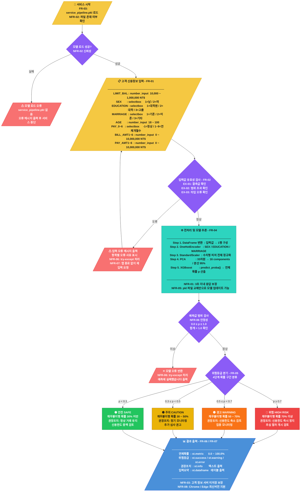

```mermaid
flowchart TD

    %% ── 스타일 정의 ──────────────────────────────────────
    classDef inputStyle   fill:#F5C842,stroke:#D4A017,color:#1a1a1a,font-weight:bold
    classDef processStyle fill:#2DD4BF,stroke:#0D9488,color:#1a1a1a,font-weight:bold
    classDef decisionStyle fill:#8B5CF6,stroke:#6D28D9,color:#ffffff,font-weight:bold
    classDef errorStyle   fill:#F87171,stroke:#DC2626,color:#ffffff,font-weight:bold
    classDef dangerStyle  fill:#EF4444,stroke:#B91C1C,color:#ffffff,font-weight:bold
    classDef warnStyle    fill:#F97316,stroke:#C2410C,color:#ffffff,font-weight:bold
    classDef cautionStyle fill:#EAB308,stroke:#A16207,color:#1a1a1a,font-weight:bold
    classDef safeStyle    fill:#22C55E,stroke:#15803D,color:#ffffff,font-weight:bold
    classDef outputStyle  fill:#4A90D9,stroke:#1D4ED8,color:#ffffff,font-weight:bold

    %% ── 1. 서비스 시작 ───────────────────────────────────
    START[/"🚀 서비스 시작
    FR-03: service_pipeline.pkl 로드
    NFR-02: 파일 존재 여부 확인"/]:::inputStyle

    START --> D1{"모델 로드 성공?
    NFR-02 신뢰성"}:::decisionStyle

    %% ── 오류: 모델 로드 실패 ─────────────────────────────
    D1 -->|실패| E1[/"⚠ 모델 로드 오류
    service_pipeline.pkl 없음
    오류 메시지 출력 후 서비스 중단"/]:::errorStyle

    %% ── 2. 고객 정보 입력 ───────────────────────────────
    D1 -->|성공| INPUT[/"📋 고객 신용정보 입력 - FR-01
    ─────────────────────────────
    LIMIT_BAL : number_input  10,000 ~ 1,000,000 NT$
    SEX       : selectbox     1=남 / 2=여
    EDUCATION : selectbox     1=대학원 / 2=대학 / 3=고졸
    MARRIAGE  : selectbox     1=기혼 / 2=미혼 / 3=기타
    AGE       : number_input  18 ~ 100
    PAY_0~6   : selectbox     -1=정상 / 1~9=연체개월수
    BILL_AMT1~6 : number_input  0 ~ 10,000,000 NT$
    PAY_AMT1~6  : number_input  0 ~ 10,000,000 NT$"/]:::inputStyle

    %% ── 3. 입력값 유효성 검사 ───────────────────────────
    INPUT --> D2{"입력값 유효성 검사 - FR-02
    EX-01: 결측값 확인
    EX-02: 범위 초과 확인
    EX-03: 타입 오류 확인"}:::decisionStyle

    D2 -->|오류| E2[/"⚠ 입력 오류 메시지 출력
    항목별 오류 사유 표시
    NFR-06: try-except 처리
    NFR-07: 앱 종료 없이 재입력 요청"/]:::errorStyle

    E2 --> INPUT

    %% ── 4. 전처리 및 모델 추론 ─────────────────────────
    D2 -->|정상| PROC["⚙ 전처리 및 모델 추론 - FR-04
    ─────────────────────────────────
    Step 1. DataFrame 변환  : 입력값 → 1행 구성
    Step 2. OneHotEncoder   : SEX / EDUCATION / MARRIAGE
    Step 3. StandardScaler  : 수치형 피처 전체 정규화
    Step 4. PCA             : 33차원 → 16 components / 분산 95%
    Step 5. XGBoost         : predict_proba() → 연체확률 p 산출
    ─────────────────────────────────
    NFR-01: 3초 이내 응답 보장
    NFR-05: pkl 파일 교체만으로 모델 업데이트 가능"]:::processStyle

    %% ── 5. 예측값 범위 검사 ────────────────────────────
    PROC --> D3{"예측값 범위 검사
    NFR-06 안정성
    0.0 ≤ p ≤ 1.0
    합계 = 1.0 확인"}:::decisionStyle

    D3 -->|이상| E3[/"✕ 모델 오류 반환
    NFR-06: try-except 처리
    예측에 실패했습니다 출력"/]:::errorStyle

    %% ── 6. 위험등급 분기 ───────────────────────────────
    D3 -->|정상| D4{"위험등급 분기 - FR-05
    4단계 확률 구간 분류"}:::decisionStyle

    D4 -->|"p ≥ 0.7"| R1["🔴 위험  HIGH RISK
    채무불이행 확률 70% 이상
    권장조치: 신용한도 즉시 정지
    추심 절차 개시 검토"]:::dangerStyle

    D4 -->|"0.5 ≤ p < 0.7"| R2["🟠 경고  WARNING
    채무불이행 확률 50 ~ 70%
    권장조치: 신용한도 축소 검토
    집중 모니터링"]:::warnStyle

    D4 -->|"0.3 ≤ p < 0.5"| R3["🟡 주의  CAUTION
    채무불이행 확률 30 ~ 50%
    권장조치: 정기 모니터링
    추가 심사 권고"]:::cautionStyle

    D4 -->|"p < 0.3"| R4["🟢 안전  SAFE
    채무불이행 확률 30% 미만
    권장조치: 정상 거래 유지
    신용한도 증액 검토"]:::safeStyle

    %% ── 7. 결과 출력 ────────────────────────────────────
    R1 & R2 & R3 & R4 --> OUTPUT

    OUTPUT[/"📊 결과 출력 - FR-06 / FR-07
    ─────────────────────────────
    연체확률  : st.metric      0.0 ~ 100.0%
    위험등급  : st.success / st.warning / st.error
    권장조치  : st.info        텍스트 출력
    입력요약  : st.dataframe   테이블 출력
    ─────────────────────────────
    NFR-03: 고객 정보 서버 미저장 보장
    NFR-08: Chrome / Edge 최신버전 지원"/]:::outputStyle
```
